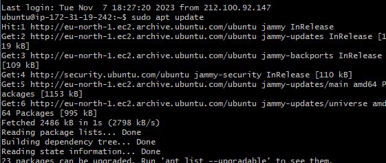
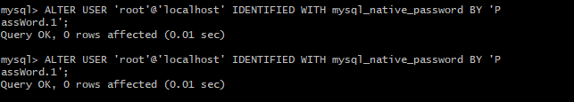

# LEMP PROJECT
This project documents the steps in building and depolying  dynamic web applications using the LEMP stack. It covers:
- Linux
- Nginx
- MYSQL
- PHP

For  this project we would use the  Git Bash to connect to our EC2 instance.

## Connecting To EC2 instance

- Syntax: ssh -i our-private-key.pem ubuntu@ EC2-Public-IP-address


## Installation of the Nginx Web Server

For this project we are making use of Nginx which serves as a powerful web server which enables us display web pages on the site for viewers.

### STEP 1 Installing the Ngnix Web Server

The apt package manager would be used to update the server Package index and also used to install Nginx

- Syntax: sudo apt update, Sudo apt install nginx




To ensure that the Nginx webserver is installed and running we run this command:

- Syntax: $ sudo systemctl status nginx


The green and running as shown in the img above. 

the TCP port 80 is also opened in our EC2 configuration in AWS to enable our Nginx web server receive traffic. 

- Access Nginx server locally in  Ubuntu Shell using the curl command.

- Syntax: $ curl http://localhost:80
or
$ curl http://127.0.0.1:80


- Access the Nginx server over the internet

- Syntax: http://<Public-IP-Address>:80


- Retrieve Public IP Address in the terminal

- Syntax: curl -s http://169.254.169.254/latest/meta-data/public-ipv4

## STEP 2 Installing MySQL

MySQL is used to store data for our web application. As usual, the apt package is used to install mysql server

- Syntax:   sudo apt install mysql-server.


- ### Login to MySQL console

- Syntax: $ sudo mysql

This command would connect to administrative database user root.


### Running Security Script
MySQL comes with pre-installed security script.  It is recommended to run this script to remove some insecure default settings and lock down acccess to the database system. It is required to set a password for the root user using mysql_native_password(default authentication method). This password would be defined with the user's password *PassWord.1*.

- Set Password:

ALTER USER 'root'@'localhost' IDENTIFIED WITH mysql_native_password BY 'PassWord.1';




- Run Interactive Script

Syntax: $ sudo mysql_secure_installation


This command  would ask if we want the VALIDATE PASSWORD PLUGIN, however if this is enabled password must match specifed criteria if not they would be rejected by MYSQL with an error. For this reason we would leave validation disabled in this documentation.

To login to MYSql console after running script

- Syntax: sudo mysql -p

The -p flag in this command will prompt you for the password used after changing the root user password. If the -p flag is not used it would return an error stating that password is required to connect


### Exiting MySQL

- Syntax: mysql> exit

## STEP 3 INSTALLING PHP

PHP is a very important component in the LEMP Stack because it is used to process code and generate dynamic content for the web server. Unlike the Apache server with embeds a PHP interpreter in each request, Nginx requires an external program to handle php processing, it equally acts as a bridge between the PHP interpreter itself and the web server.

### Configuring PHP
This requires the installation of *php-fpm*, which stands for **PHP fastCGI process manager**, this tells Nginx to pass PHP request to this software for processing. We also need *php-mysql*, an important PHP module that allows PHP to communicate with MYSQL-based databases. Core  PHP packages will automatically be installed as dependencies

 - Syntax: $ sudo apt install php-fpm php-mysql

The syntax would install the 2 packages at once


## STEP 4 Configuring Nginx to Use PHP Processor
Server blocks can be created in Nginx web server to encapsulate configuration details and host more than one domain on a single server just like Virtual host in Apache.

One server block is enabled by default on Ubuntu 20.04 to serve documents out of a directory **/var/www/html. For a single site this is perfect but for multiple site it becomes difficult to manage. For better site management we would create a directory structure within /var/www for the **your_domain** leaving  /var/www/html in place as the default directory to be served if a client request doesn't match any other sites

### Creating the root web directory

To Create root directory for your_domain:

- Syntax: $ sudo mkdir /var/www/projectLEMP

### Assign Ownership of the directory:
The $USER environment variable will be used to assign ownership to the directory, This will reference the current system user:

- Syntax: $ sudo chown -R $USER:$USER /var/www/projectLEMP

### Set Nginx Configuration file with values
A new configuration file will now be created in the Nginx;s sites-available directory using the nano editor

- Syntax: $ sudo nano /etc/nginx/sites-available/projectLEMP

### Activate Configuration

The configuration would be activated by linking the config file from the Nginx sites-enabled directory by using the command below:

- Syntax:  $ sudo ln -s /etc/nginx/sites-available/projectLEMP /etc/nginx/sites-enabled/

This command simply tells Nginx to use the configuration next time its reloaded


The image below shows the implementation of the documentation above
 


### Testing Configuration and disable default Host

To test our configuration we use the syntax below:

Syntax: $ sudo nginx -t


From the img above, we see the syntax is ok

To ensure our new configuration works we need to disable default host and then reload Nginx to apply changes using  the command below respectively

- Syntax: sudo unlink /etc/nginx/sites-enabled/default

- Syntax:$ sudo systemctl reload nginx


### Testing PHP with Nginx

In this section we would test to validate that nginx can correctly handle .php file to PHP processor.  To do this we would create  an info.php file  and save phpinfo(); within the php tag

$ nano /var/www/projectLEMP/info.php

To test this on the browser:

http://`server_domain_or_IP`/info.php


The img page shows the info.php page which shows information about the page. the rm command can be used to remove this file:

-syntax: $ sudo rm /var/www/projectlemp/info.php


## STEP 6 Retrieving data from MySQL database with PHP

To implement this, a test database with a simple "To do list" would be created and configured to access it to enable us query data from the Database and display it.

The mysql_native_password authentication method would be used to create a  new user, to  connect to the MySQL database from PHP

- Connect to MySQL using the root account

Syntax: $ sudo mysql

- Create database named example_database
Syntax: mysql> CREATE DATABASE `example_database`;


- Create a new  User

Create a new user callled exampler_user using the mysql_native_password as default authentication method. The user password is set as PassWord.1.

Syntax: mysql>  CREATE USER 'example_user'@'%' IDENTIFIED WITH mysql_native_password BY 'PassWord.1';


- Grant User permission on the example_database

Syntax: mysql> GRANT ALL ON example_database.* TO 'example_user'@'%';


The next steip is to exit mysql using: mysql> exit

-Login using  custom user credentials

-Syntax: $ mysql -u example_user -p

The -p is to prompt you for user password that was used when creating the example_user.

Syntax:$ mysql -u example_user -p


### View Databases

The permission has given the user access to view the databases and work with the databases. To view the database

Syntax: mysql> SHOW DATABASES;


### Create Table, insert and select

The command below creates a simple table called todolist

Syntax: CREATE TABLE example_database.todo_list (item_id INT AUTO_INCREMENT,content VARCHAR(255),PRIMARY KEY(item_id));

To add some items to the table we created use:

Syntax:mysql> INSERT INTO example_database.todo_list (content) VALUES ("My first important item");

To view to ensure the items have been added we use the select command using the syntax below:

Syntax: mysql>  SELECT * FROM example_database.todo_list;


### Create PHP script 

First a php file(Todo_list.php) would be created in our custom web root directory projectLEMP

Syntax: $ nano /var/www/projectLEMP/todo_list.php


The following php script would be added to the file. This PHP Script connects the MySQL database and queries for the content in the todo_list table and  displays the result in a list

```
<?php
$user = "example_user";
$password = "PassWord.1";
$database = "example_database";
$table = "todo_list";

try {
  $db = new PDO("mysql:host=localhost;dbname=$database", $user, $password);
  echo "<h2>TODO</h2><ol>";
  foreach($db->query("SELECT content FROM $table") as $row) {
    echo "<li>" . $row['content'] . "</li>";
  }
  echo "</ol>";
} catch (PDOException $e) {
    print "Error!: " . $e->getMessage() . "<br/>";
    die();
}

 ```

 After saving and closing this file, we  can visit this page in the web browser by visiting the domain name or public IP address configured for the website, followed by /todo_list.php

 http://Public_domain_or_IP/todo_list.php

 


